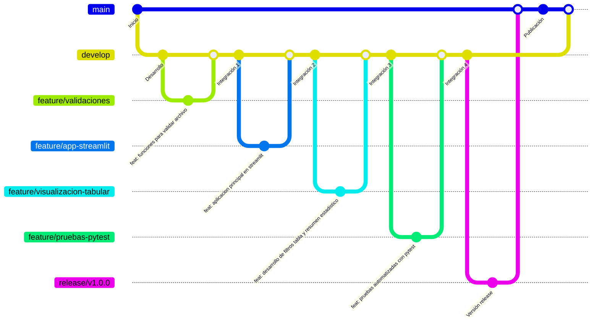

# Informe - Actividad No. 1 Gitflow con Streamlit
<p align="center">
    
[](#)
[](#)
[](#)
[](#)

</p>

## 👨‍💻 Integrantes

| Nombre |
| --- |
| Oscar Maldonado |
| Daniel Alquinga |

## 🎯 Objetivo

Desarrollar una aplicación Streamlit para cargar, validar y analizar el archivo `penguins.csv`, aplicando el flujo de trabajo Gitflow mediante ramas de desarrollo, funcionalidades, release y tag de versión.

## 📖 Descripción Del Proyecto

El proyecto consiste en un dashboard web construido con Streamlit que permite analizar el dataset `penguins.csv`. La aplicación valida que el archivo exista, comprueba que el conjunto de datos no esté vacío y verifica que las columnas requeridas estén presentes antes de mostrar métricas, gráficos y una visualización tabular filtrable.

## 📃 Procedimiento Realizado

1. Se verificó la instalación de Git con `git --version`.
2. Se verificó la instalación de Python con `python --version`.
3. Se creó la estructura del proyecto con carpetas `src`, `tests` y `docs`.
4. Se incorporó el archivo `penguins.csv` al repositorio.
5. Se creó el archivo `requirements.txt` con las dependencias necesarias.
6. Se implementaron las validaciones en `src/validators.py`.
7. Se desarrolló la aplicación principal en `app.py` usando Streamlit.
8. Se implementó la visualización tabular en `src/data_view.py`.
9. Se agregaron pruebas unitarias en `tests/test_validators.py`.
10. Se documentó el proyecto en `README.md` e `INFORME.md`.
11. Se aplicó Gitflow mediante ramas `main`, `develop`, ramas `feature` y rama `release/v1.0.0`.
12. Se generó el tag `v1.0.0` para identificar la versión entregable.

## ➿ Ramas Gitflow Utilizadas



| Rama | Descripción |
| --- | --- |
| `main` | Rama estable donde queda publicada la versión final |
| `develop` | Rama de integración de funcionalidades |
| `feature/validaciones` | Desarrollo de funciones para validar archivo, columnas y datos |
| `feature/app-streamlit` | Desarrollo de la aplicación principal en Streamlit |
| `feature/visualizacion-tabular` | Desarrollo de filtros, tabla y resumen estadístico |
| `feature/pruebas-pytest` | Desarrollo de pruebas automatizadas con pytest |
| `release/v1.0.0` | Preparación de la versión final del proyecto |

No se utilizó rama `hotfix` y no se realizó resolución de conflictos.

## 💾 Instalación

### 🏁 Carga inicial del proyecto

1. Despues de generar las carpetas de acuerdo a la estructura, creamos el entorno virtual y aceptamos los valores por defecto
```bash
mkdir Tarea1Gitflow
cd Tarea1Gitflow
touch README.md requirements.txt .gitignore
git init
git flow init
```
2. Editamos el archivo requirements.txt
```bash
streamlit
pandas
pytest
matplotlib
```
3. Instalar dependencias.
```bash
python3 -m venv venv
source venv/bin/activate
pip install -r requirements.txt
```
4. Creacion de las funciones de validación, visualización, pytest y aplicación en streamlit.
```bash
touch src/validators.py src/data_view.py tests/test_validators.py app.py
```
5. Crear el archivo .gitignore.
```bash
__pycache__/
*.pyc
.venv/
venv/
.env
.pytest_cache/
.streamlit/
```
6. Copiar el archivo penguins.csv a la carpeta del proyecto.
```bash
cp ~/Descargas/penguins.csv penguins.csv
```
7. Revisar el estado enviar a stage y realizar el commit.
```bash
git add .
git commit -m "Carga inicial"
```

### 📋 Nuevo feature con GitFlow: feature/validaciones

1. Crear la rama develop.
```bash
git checkout -b develop
```
2. Crear la rama feature/validaciones.
```bash
git flow feature start validaciones
```
3. Modificamos el archivo src/validators.py
```bash
from pathlib import Path

import pandas as pd


REQUIRED_COLUMNS = {
    "species",
    "island",
    "bill_length_mm",
    "bill_depth_mm",
    "flipper_length_mm",
    "body_mass_g",
    "sex",
}


def validate_file_exists(file_path: str | Path) -> tuple[bool, str]:
    """Validate that the CSV file exists before loading it."""
    path = Path(file_path)
    if not path.exists():
        return False, f"El archivo no existe: {path}"
    if not path.is_file():
        return False, f"La ruta indicada no corresponde a un archivo: {path}"
    return True, "Archivo encontrado correctamente."


def load_dataset(file_path: str | Path) -> pd.DataFrame:
    """Load the penguins CSV file using controlled validation."""
    is_valid, message = validate_file_exists(file_path)
    if not is_valid:
        raise FileNotFoundError(message)

    return pd.read_csv(file_path, na_values=["NA", "", "null", "None"])


def validate_required_columns(df: pd.DataFrame) -> tuple[bool, str]:
    """Validate that the DataFrame contains the expected penguins columns."""
    missing_columns = sorted(REQUIRED_COLUMNS.difference(df.columns))
    if missing_columns:
        return False, "Faltan columnas obligatorias: " + ", ".join(missing_columns)
    return True, "El dataset contiene las columnas obligatorias."


def validate_not_empty(df: pd.DataFrame) -> tuple[bool, str]:
    """Validate that the dataset has at least one row."""
    if df.empty:
        return False, "El dataset esta vacio."
    return True, "El dataset contiene registros."


def validate_penguins_dataset(df: pd.DataFrame) -> tuple[bool, list[str]]:
    """Run all business validations required by the dashboard."""
    validations = [
        validate_not_empty(df),
        validate_required_columns(df),
    ]
    messages = [message for _, message in validations]
    is_valid = all(result for result, _ in validations)
    return is_valid, messages
```
4. Probar.
```bash
python3 src/validators.py
```
5. Realizamos el commit.
```bash
git add src/validators.py
git commit -m "feat: funciones para validar archivo"
```
6. Finalizar el feature.
```bash
git flow feature finish validaciones
```
### 📋 Nuevo feature con GitFlow: feature/app-streamlit

1. Crear la rama feature/app-streamlit.
```bash
git flow feature start app-streamlit
```
2. Modificamos el archivo app.py
```bash
from pathlib import Path

import matplotlib.pyplot as plt
import streamlit as st

from src.data_view import show_data_table
from src.validators import load_dataset, validate_penguins_dataset


DATA_FILE = Path(__file__).parent / "penguins.csv"


def main() -> None:
    st.set_page_config(
        page_title="Penguins Analytics",
        page_icon="🐧",
        layout="wide",
    )

    st.title("Dashboard de Analisis de Penguins")
    st.write(
        "Aplicacion Streamlit para cargar, validar y explorar el dataset "
        "penguins.csv como parte de una practica de Gitflow."
    )

    try:
        df = load_dataset(DATA_FILE)
    except FileNotFoundError as error:
        st.error(str(error))
        st.stop()
    except Exception as error:
        st.error(f"No fue posible cargar el dataset: {error}")
        st.stop()

    is_valid, messages = validate_penguins_dataset(df)
    st.subheader("Validaciones del dataset")
    for message in messages:
        st.success(message) if is_valid else st.warning(message)

    if not is_valid:
        st.error("La estructura del archivo no es valida para el dashboard.")
        st.stop()

    species_count = df["species"].dropna().nunique()
    island_count = df["island"].dropna().nunique()

    st.subheader("Metricas generales")
    col1, col2, col3, col4 = st.columns(4)
    col1.metric("Total de registros", f"{len(df):,}")
    col2.metric("Total de columnas", len(df.columns))
    col3.metric("Especies disponibles", species_count)
    col4.metric("Islas disponibles", island_count)

    st.subheader("Distribucion por especie")
    species_distribution = df["species"].value_counts().sort_index()
    fig, ax = plt.subplots(figsize=(8, 4))
    species_distribution.plot(kind="bar", ax=ax, color="#2563eb")
    ax.set_xlabel("Especie")
    ax.set_ylabel("Cantidad de registros")
    ax.set_title("Cantidad de pinguinos por especie")
    st.pyplot(fig)

    show_data_table(df)


if __name__ == "__main__":
    main()
```
3. Realizamos el commit.
```bash
git add app.py
git commit -m "feat: aplicacion principal en streamlit"
```
4. Finalizar el feature.
```bash
git flow feature finish app-streamlit
```

### 📋 Nuevo feature con GitFlow: feature/visualizacion-tabular

1. Crear la rama feature/visualizacion-tabular.
```bash
git flow feature start visualizacion-tabular
```
2. Modificamos el archivo src/data_view.py
```bash
import pandas as pd
import streamlit as st


def show_data_table(df: pd.DataFrame) -> None:
    """Render filters, preview, full table and numeric summary for the dataset."""
    st.subheader("Visualizacion tabular de datos")

    filtered_df = df.copy()
    filter_columns = st.columns(2)

    if "species" in filtered_df.columns:
        species_options = sorted(filtered_df["species"].dropna().unique())
        selected_species = filter_columns[0].multiselect(
            "Filtrar por especie",
            options=species_options,
            default=species_options,
        )
        if selected_species:
            filtered_df = filtered_df[filtered_df["species"].isin(selected_species)]

    if "island" in filtered_df.columns:
        island_options = sorted(filtered_df["island"].dropna().unique())
        selected_islands = filter_columns[1].multiselect(
            "Filtrar por isla",
            options=island_options,
            default=island_options,
        )
        if selected_islands:
            filtered_df = filtered_df[filtered_df["island"].isin(selected_islands)]

    st.caption(f"Registros visibles: {len(filtered_df):,}")
    st.write("Vista previa")
    st.dataframe(filtered_df.head(10), use_container_width=True)

    with st.expander("Mostrar tabla completa"):
        st.dataframe(filtered_df, use_container_width=True)

    numeric_df = filtered_df.select_dtypes(include="number")
    if not numeric_df.empty:
        st.write("Resumen estadistico")
        st.dataframe(numeric_df.describe(), use_container_width=True)
```
3. Realizamos el commit.
```bash
git add src/data_view.py
git commit -m "feat: desarrollo de filtros tabla y resumen estadistico"
```
4. Finalizar el feature.
```bash
git flow feature finish visualizacion-tabular
```

### 📋 Nuevo feature con GitFlow: feature/pruebas-pytest

1. Crear la rama feature/pruebas-pytest.
```bash
git flow feature start pruebas-pytest
```
2. Modificamos el archivo tests/test_validators.py
```bash
from pathlib import Path

import pandas as pd

from src.validators import (
    REQUIRED_COLUMNS,
    load_dataset,
    validate_file_exists,
    validate_not_empty,
    validate_penguins_dataset,
    validate_required_columns,
)


def test_penguins_file_exists() -> None:
    file_path = Path(__file__).resolve().parents[1] / "penguins.csv"

    is_valid, message = validate_file_exists(file_path)

    assert is_valid is True
    assert "Archivo encontrado" in message


def test_empty_dataframe_is_invalid() -> None:
    df = pd.DataFrame(columns=sorted(REQUIRED_COLUMNS))

    is_valid, message = validate_not_empty(df)

    assert is_valid is False
    assert "vacio" in message


def test_missing_required_columns_is_invalid() -> None:
    df = pd.DataFrame(
        {
            "species": ["Adelie"],
            "island": ["Torgersen"],
        }
    )

    is_valid, message = validate_required_columns(df)

    assert is_valid is False
    assert "bill_length_mm" in message


def test_dataframe_with_required_columns_is_valid() -> None:
    df = pd.DataFrame(
        {
            "species": ["Adelie"],
            "island": ["Torgersen"],
            "bill_length_mm": [39.1],
            "bill_depth_mm": [18.7],
            "flipper_length_mm": [181],
            "body_mass_g": [3750],
            "sex": ["male"],
        }
    )

    is_valid, messages = validate_penguins_dataset(df)

    assert is_valid is True
    assert len(messages) == 2


def test_load_dataset_reads_temporary_csv(tmp_path: Path) -> None:
    csv_file = tmp_path / "penguins_temp.csv"
    csv_file.write_text(
        "species,island,bill_length_mm,bill_depth_mm,flipper_length_mm,body_mass_g,sex\n"
        "Adelie,Torgersen,39.1,18.7,181,3750,male\n",
        encoding="utf-8",
    )

    df = load_dataset(csv_file)

    assert len(df) == 1
    assert list(df.columns) == [
        "species",
        "island",
        "bill_length_mm",
        "bill_depth_mm",
        "flipper_length_mm",
        "body_mass_g",
        "sex",
    ]
```
3. Realizamos el pytest.
```bash
pytest -v
```
4. Realizamos el commit.
```bash
git add tests/test_validators.py
git commit -m "feat: pruebas automatizadas con pytest"
```
5. Finalizar el feature.
```bash
git flow feature finish pruebas-pytest
```

### 🎌 Generar la version release

1. Crear la version release.
```bash
git flow release start 1.0.0
```
2. Crear el archivo VERSION.
```bash
echo "1.0.0" > VERSION
```
3. Actualizar el README.md
```bash
nano README.md
```
4. Realizamos el commit.
```bash
git add README.md VERSION
git commit -m "Preparar release 1.0.0"
```
5. Finalizar el release.
```bash
git flow release finish 1.0.0
```
6. Verificación.
```bash
git tag
git log --oneline --graph --all
```

## ⏯️ Ejecución De La Aplicación

```bash
streamlit run app.py
```

La aplicación cargará el archivo `penguins.csv`, ejecutará validaciones y mostrará el dashboard con métricas, gráfico y tabla filtrable.

---

## ⏯️ Ejecución De Pruebas

```bash
pytest
```

Las pruebas verifican la existencia del archivo, la validez estructural del dataset, el manejo de DataFrames vacíos y la carga de archivos CSV temporales.

---


## 🔍 Evidencias De Ejecución

### Aplicación Principal


### Visualización Tabular


### Pruebas Con Pytest


## 💡 Conclusiones Técnicas

1. Gitflow permitió separar el desarrollo funcional en ramas independientes, reduciendo el riesgo de afectar la rama principal durante la construcción de la aplicación.
2. La rama `develop` funcionó como punto de integración para validar las funcionalidades antes de preparar una versión estable en la rama de release.
3. El uso de tags facilitó la identificación de una versión entregable de la aplicación, permitiendo conservar trazabilidad entre código, pruebas y documentación.
